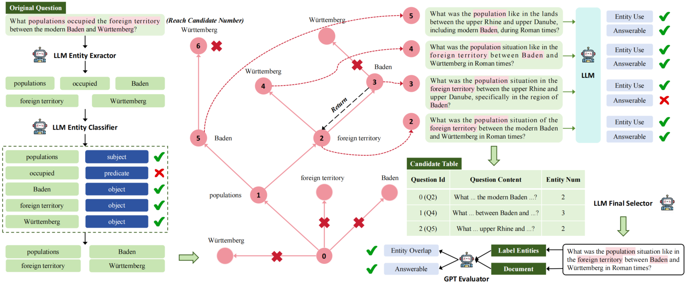
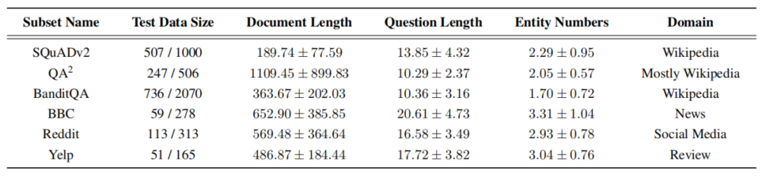
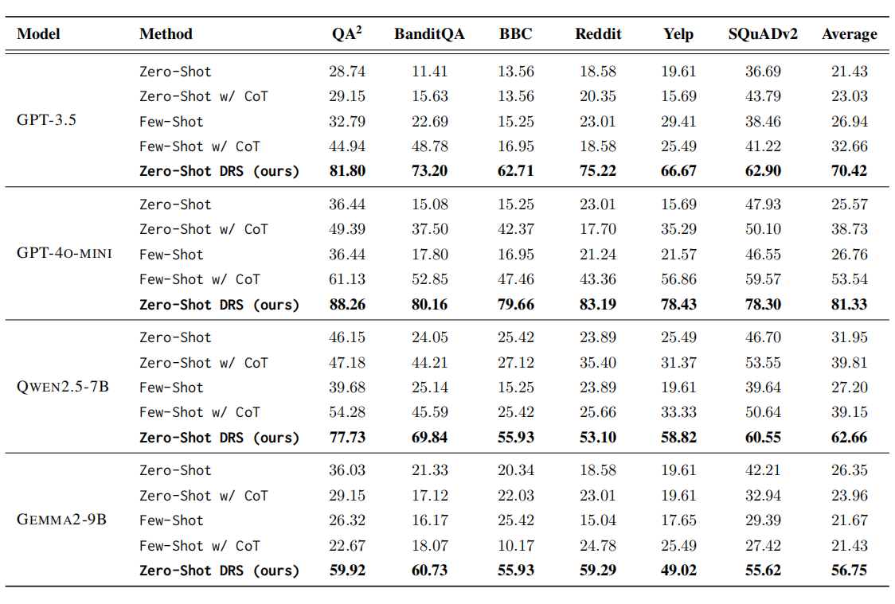
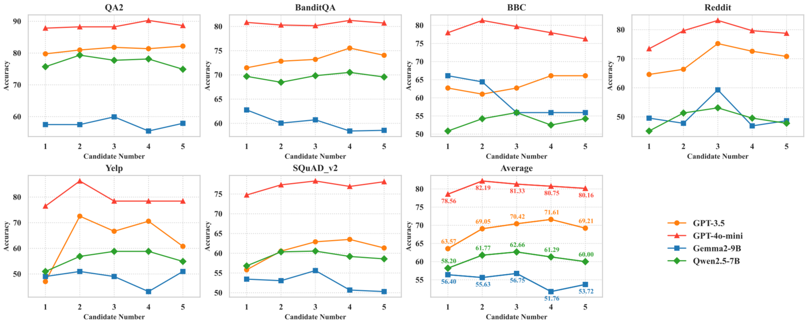

## DRS: Deep Question Reformulation With Structured Output

This is the repository for our paper [DRS: Deep Question Reformulation With Structured Output]()

In this paper, our proposed DRS method leverages LLMs and the DFS-based algorithm to iteratively search for possible entity combinations and constrain the output with certain entities, effectively improving the capabilities of LLMs in question reformulation.

Our approach consists of three main steps: 

- Entity Extraction and Filtering, where LLMs are used to extract core entities and classify extracted entities to preserve certain types of entities.
- Entity Combination Search and Structured Output Generation, which employs a DFS-based algorithm to identify entity combinations to form answerable questions with entity constraint.
- DFS Pruning and Candidate Selection, where we limit the number of candidate questions and search depth through DFS pruning, then select the most reliable question from the candidate table according to question content and entity number for final output.



------------------------------------------------------------------------------------------------------------------------------------------------------------------------

#### Run Codes

##### 1. Install Packages

```bas
pip install -r requirements.txt
```

##### 2. OpenAI & HuggingFace

- Use the ``config.yaml`` file to set your ``OpenAI api key``.

```bas
openai:
  api_key: "YOUR_API_KEY"
  organization: "YOUR_ORGANIZATION"
```

- Use the environment variable to set your ``HuggingFace token``.

```bash
export HF_TOKEN="your_hf_token"
```

##### 3. Baseline

- Change the ``parameters.yaml`` file.
- Switch ``subset_name`` to run on six different datasets. (Possible names are listed in the ``parameters.yaml``)
- Try different baseline methods through the ``type`` parameter. (Possible types are listed in the ``parameters.yaml``)
- Modify ``run_model`` to run with different LLMs. (If you are using ``OpenAI`` models, set the ``run_model_platform`` to ``openai``; otherwise, set the ``run_model_platform`` to ``huggingface`` for open-source models)

```bas
python baseline_openai.py | python baseline_huggingface.py
```

##### 4. DRS

- Change the ``parameters.yaml`` file.
- Switch ``subset_name`` to run on six different datasets. (Possible names are listed in the ``parameters.yaml``)
- Modify ``run_model`` to run with different LLMs. (If you are using ``OpenAI`` models, set the ``run_model_platform`` to ``openai``; otherwise, set the ``run_model_platform`` to ``huggingface`` for open-source models)

```bas
python drs_openai.py | python drs_huggingface.py
```

------------------------------------------------------------------------------------------------------------------------------------------------------------------------

#### Datasets

You could download the [CouldAsk](https://huggingface.co/datasets/wentingzhao/couldask) from HuggingFace.



------------------------------------------------------------------------------------------------------------------------------------------------------------------------

#### Experiments

To demonstrate the effectiveness of our proposed zero-shot DRS method, we test it on six datasets, totaling over 1,700 data points, using four different LLMs. We conduct a fair and thorough comparison between our method and four baseline methods from previous research, with all accuracy scores presented in the table below.


To explore the impact of this parameter on the performance of our zero-shot DRS method, we conduct experiments with varying numbers of candidate questions and observe how accuracy changes. We set the number of candidate questions from 1 to 5 for each LLM and test on all datasets, with the results shown in the figure below. 



------------------------------------------------------------------------------------------------------------------------------------------------------------------------

#### Questions?
If you have any questions related to the repo or the paper, or you encounter any problems when using the code, feel free to email Zhecheng Li (zhl186@ucsd.edu).